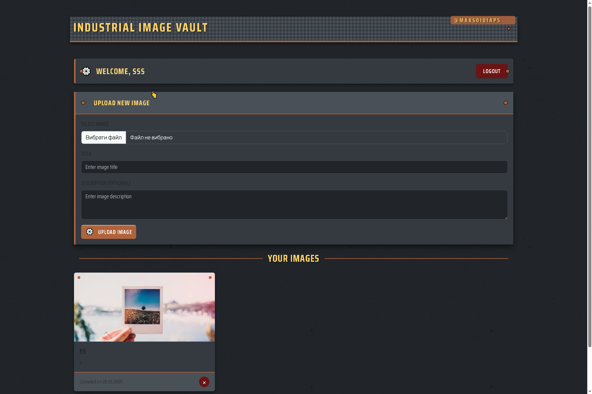
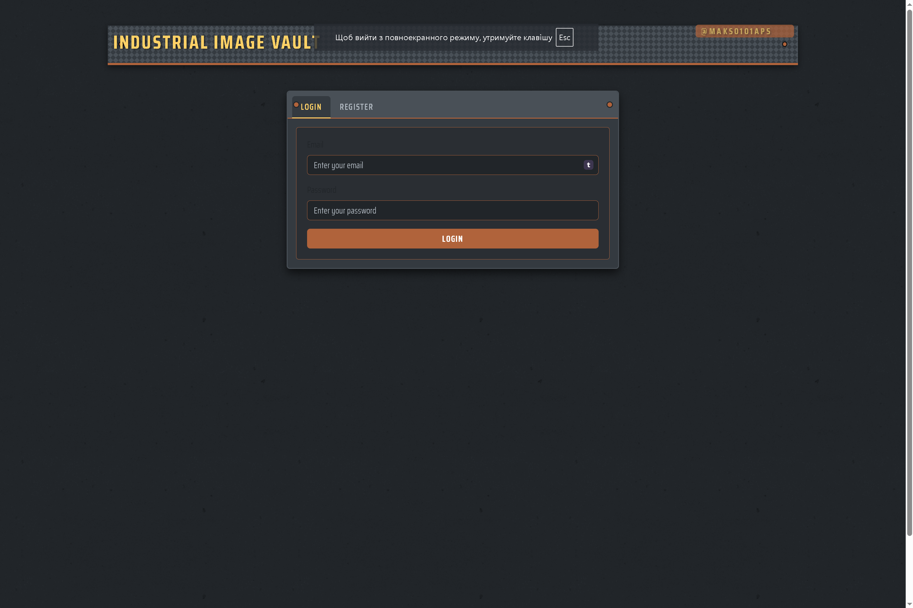
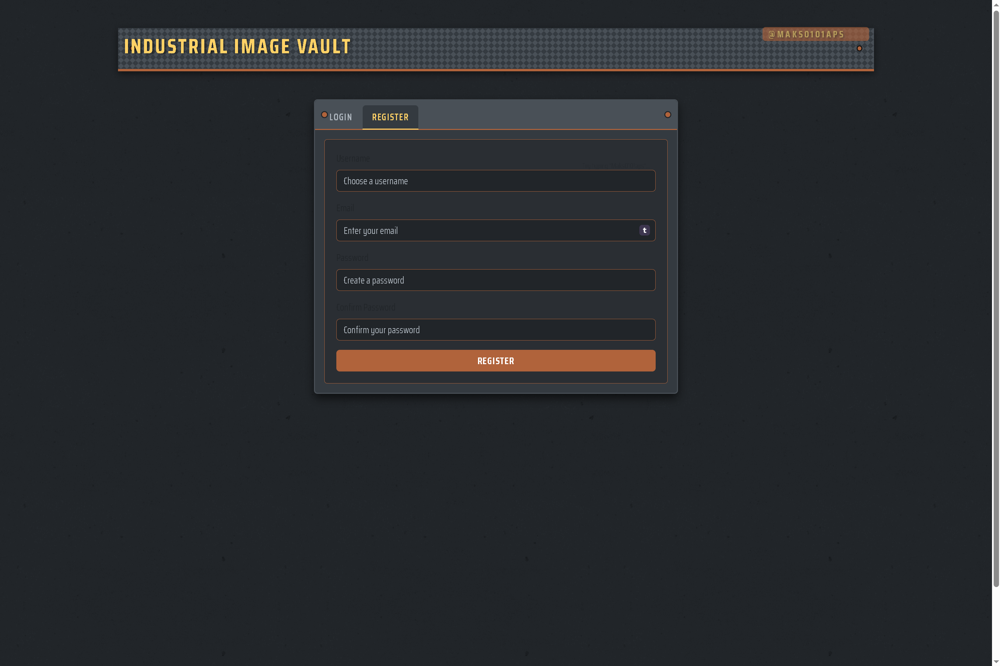

# Industrial Image Vault



A stylish industrial-themed image gallery application built with modern web technologies. Upload, view, and manage your images with a unique factory-inspired interface.

## Features

- 🏭 Industrial design with steel, rust, and gear aesthetics
- 🔐 User authentication (login/register)
- 📤 Image upload with title and description
- 🖼️ Fullscreen image viewing modal
- 📱 Responsive layout for all devices
- 🔍 Interactive interface elements
- 💾 Image management (view, upload, delete)

## Technologies Used

### Frontend
- **Svelte**: Lightweight reactive component framework
- **Bootstrap**: For responsive layouts and UI components
- **CSS Custom Properties**: For industrial-themed styling
- **Modern JavaScript**: ES6+ features for enhanced functionality
- **Web Animations**: For UI transitions and effects

### Backend
- **Node.js**: JavaScript runtime
- **Express**: Web framework for handling API requests
- **MySQL/JSON**: Data storage options
- **JWT**: For secure authentication
- **Multer**: For handling file uploads

## Project Structure

```
ImageGallery/
├── backend/                # Backend API server
│   ├── controllers/        # Request handlers
│   ├── middleware/         # Custom middleware
│   ├── models/             # Data models
│   ├── routes/             # API routes
│   └── server.js           # Main server file
│
├── frontend/               # Svelte frontend application
│   ├── public/             # Static assets
│   └── src/                # Source code
│       ├── components/     # Reusable components
│       │   ├── Gallery.svelte  # Image gallery component
│       │   ├── Login.svelte    # Login component
│       │   └── ...
│       ├── App.svelte      # Main application component
│       └── main.js         # Entry point
│
└── screenshots/            # Project screenshots for documentation
```

## Setup Instructions

### Prerequisites
- Node.js (v14+)
- npm or yarn

### Installation

1. Clone the repository:
```
git clone https://github.com/Maks0101aps/ImageGallery.git
cd ImageGallery
```

2. Install dependencies:
```
# Install backend dependencies
cd backend
npm install

# Install frontend dependencies
cd ../frontend
npm install
```

3. Configure environment:
- Create a `.env` file in the backend directory with the following:
```
PORT=3001
JWT_SECRET=your_jwt_secret
DB_HOST=localhost
DB_USER=root
DB_PASSWORD=your_password
DB_NAME=image_gallery
```

4. Start the servers:
```
# Start backend server
cd backend
npm start

# In a new terminal, start frontend development server
cd frontend
npm run dev
```

5. Open your browser and navigate to:
```
http://localhost:5173
```

## Screenshots

### Main Gallery View


### Login Screen


### Registration Screen


## Easter Eggs

This application contains several hidden easter eggs that demonstrate attention to detail and add a fun interactive element for users who discover them:

1. **GitHub Link in Footer**: 
   - Look for the gear icon ⚙️ next to the creator's name in the footer
   - Hovering over this link causes a subtle animation

2. **Konami Code**:
   - Enter the famous Konami Code sequence: ↑ ↑ ↓ ↓ ← → ← → B A
   - A notification will appear with a link to the creator's GitHub profile

3. **Hidden Text in Header**:
   - Hover over the title "INDUSTRIAL IMAGE VAULT" to reveal a hidden link
   - The creator's GitHub username appears with a tooltip 

4. **Click Counter Easter Egg**:
   - Click the "UPLOAD NEW IMAGE" text 5 times in succession
   - A small notification will appear acknowledging you found the easter egg

5. **Secret Link in Image Modal**:
   - When viewing an image in fullscreen mode, look in the footer
   - A subtle GitHub badge becomes more visible when hovered

6. **HTML Source Comments**:
   - Checking the source code reveals hidden comments and meta author tags
   - Look for the specially formatted creator signature in the HTML

To find all easter eggs, try clicking on different UI elements, examine the page carefully, and use keyboard shortcuts. Happy hunting!

## Created By

This project was created by [Maks0101aps](https://github.com/Maks0101aps).

## License

MIT License